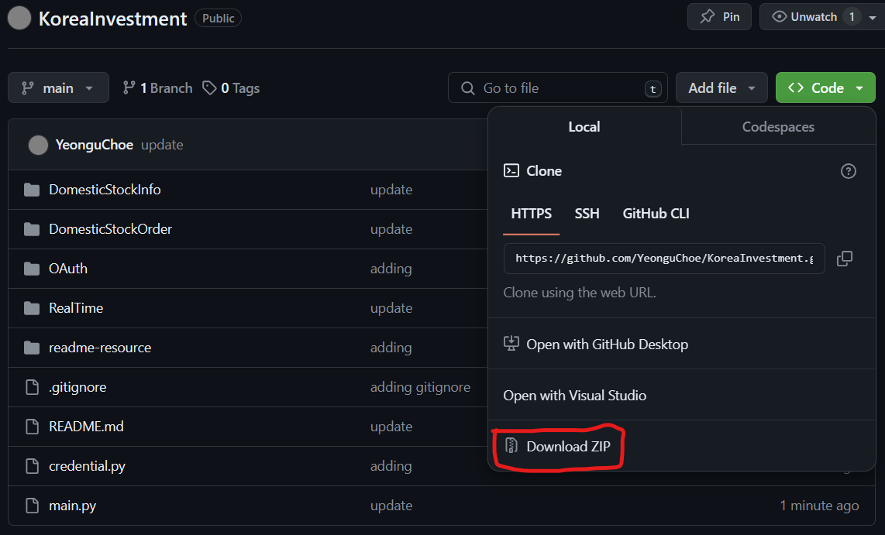

# Korea Investment & Securities Algorithm trading
In Korean stock market, every home trading software runs on only Windows.
Some people have great trading knowledge but don't have coding experience.
I made this python OOP script for the people who only have Mac or have great trading knowledge but little to no coding experience to be able to do system trading.

## Setting up
1. Create an Korea Investment & Securities account and generate the API key.
2. Download the zip file from GitHub.



3. Unzip the file and open **KOREAINVEST** directory with your favorite code editor.

4. In `credential.py`, input generated credentials: CANO, APP_Key, APP_SECRET


5. In `main.py`, `run get_access_token` and `get_approval_key`

```python
async def main():
    get_access_token()
    get_approval_key()
```

6. Once, access token and approval key are generated, you can start trading.

## Information of the stock
### Code you must keep in the main script
- This code reads token and key for server connection.
```python
async def main():
    t = read_access_token()
    k = read_approval_key()
```

### Basic Information
- daily_exchange_volume
    > If you don't put the date, it is set to today's date as default.
    - example
    ```python
    daily_exchange_volume(t, "035420","20240101")
    ```
    - result
    ```bash
    ==================================================
    Trade Quantity
    ==================================================
    Company name: NAVER
    Date: 2024-March-21
    ==================================================
    Total buy quantity: 429405
    Total sell quantity: 545601
    ==================================================
    ```
- get_candlestick
    - example
    ```python

    ```
    - result
    ```bash

    ```
- get_stock_name
    - example
    ```python

    ```
    - result
    ```bash
    
    ```
- get_price
> This is not the real time price. It is a quote price.
If you are looking for real time price, use `print_realtime_price` at the bottom.

    - example
    ```python

    ```
    - result
    ```bash
    
    ```
### Realtime Information
> For realtime information, you can only use theses method when the Korea stock market is opened (**PST 5:00 PM - 11:30 PM**)
- print_realtime_price
    - example
    ```python

    ```
    - result
    ```bash
    
    ```

- market_depth
    - example
    ```python

    ```
    - result
    ```bash
    
    ```

## Order
### Buy stock
- buy
    - example
    ```python

    ```
    - result
    ```bash
    
    ```
- list_buy_order
    - example
    ```python

    ```
    - result
    ```bash
    
    ```

### Sell stock
- sell
- list_sell_order

### Modifying order
- cancel_order

### Current Account status
- get_remaining_cash
- get_remaining_stock